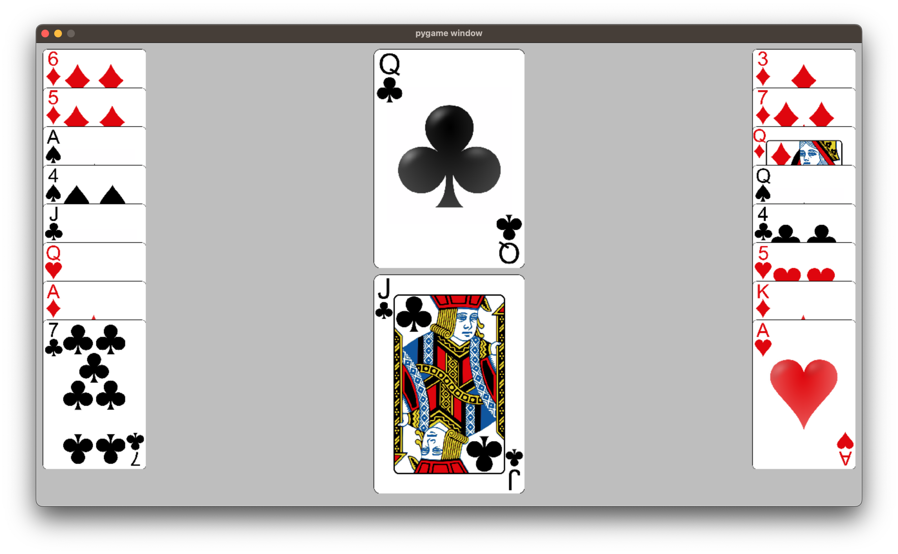

# Card Game View-Controller

A view and controller for simple card games. Works best for games with 1-4 players and 1-5 discard and decks combined.

# Usage

Everything has type hints and comments. Check out an example [here](./example.py).

# Assets

- [OpenSource Playing Card Images - Google Code Archive](https://code.google.com/archive/p/vector-playing-cards/)
